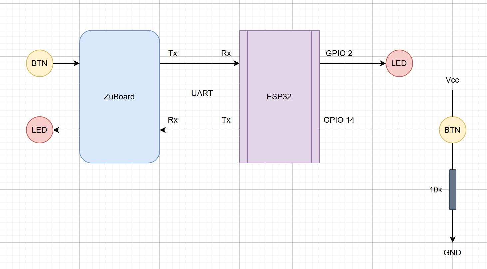

# UART_fpga_esp32
FPGA interface with ESP32 via UART protocol

Button và đèn LED giao thông kết nối phía ESP32.
Khi nhấn BTN trên Zuboard thì gửi lệnh đến ESP32 qua UART, bật tắt đèn giao thông.
Khi nhấn button trên breadboard thì gửi lệnh ESP32 -> Zuboard qua UART, bật tắt led trên Zuboard

https://github.com/user-attachments/assets/3eb77551-ba09-4808-97e8-d49f98378953
